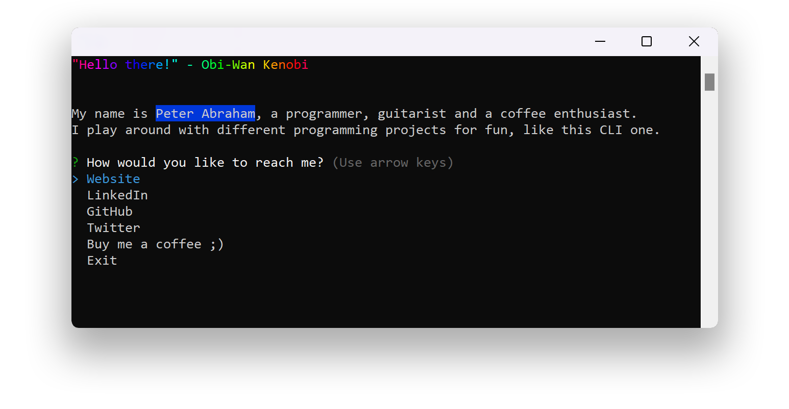

# peterabraham


## Run
First, you will have to have NodeJS installed. After, run the following command:
```bash
npx peterabraham
```
**Note**: This app uses top-level await which is only supported from NodeJS version 14.8 or above.
